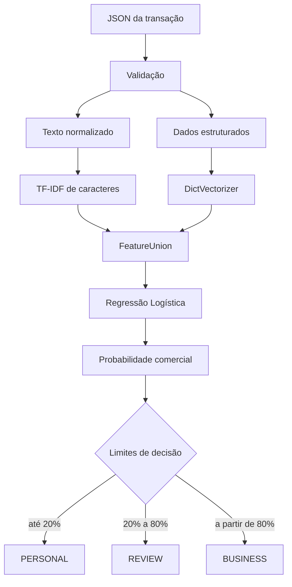

# Como o algoritmo funciona

Este documento explica a versão `0.1.0` do classificador de transações do projeto Finance Tech. O objetivo é permitir que outra pessoa entenda, teste, audite e evolua o modelo sem precisar descobrir as decisões somente lendo o código.

## 1. Problema resolvido

O classificador recebe uma transação bancária de uma conta de MEI e estima se ela é:

- `BUSINESS`: relacionada à atividade da empresa;
- `PERSONAL`: relacionada à vida pessoal do titular;
- `REVIEW`: o modelo não possui segurança suficiente e solicita revisão humana.

A classificação não depende apenas da descrição. Uma compra em um atacadista pode ser pessoal para um pintor e comercial para uma lanchonete. Por isso o algoritmo combina texto, CNAE, valor, direção, horário, tipo da operação, contraparte e histórico.

## 2. Visão geral



O pipeline possui dois ramos independentes. Um transforma texto bancário em números e o outro transforma campos estruturados em números. As duas matrizes são unidas antes da classificação.

## 3. Carregamento e validação

O módulo `src/finance_classifier/data.py` aceita:

- uma lista JSON de transações;
- um objeto contendo `transactions`;
- um objeto contendo `transaction`;
- uma única transação.

Durante o treinamento, cada registro precisa possuir:

- uma descrição em `descriptionRaw` ou `description`;
- `amount` numérico;
- `type` igual a `CREDIT` ou `DEBIT`;
- `accountId`, usado exclusivamente para separar os grupos;
- `target.classification` igual a `BUSINESS` ou `PERSONAL`.

O carregador também exige que o conjunto de treinamento tenha as duas classes e pelo menos duas contas diferentes.

## 4. Ramo de texto

O código está em `src/finance_classifier/features.py`.

### 4.1 Composição

O texto usado pelo modelo combina:

- `descriptionRaw`;
- `description`;
- nome normalizado da contraparte;
- nome do estabelecimento, quando disponível;
- categoria fornecida pelo banco;
- CNAE principal;
- descrição da atividade empresarial.

O algoritmo não inclui CPF, CNPJ, `accountId`, identificador da transação ou `target` no texto.

### 4.2 Normalização

Antes da vetorização, o texto passa pelas seguintes etapas:

1. conversão para maiúsculas;
2. remoção de acentos;
3. substituição de símbolos por espaços;
4. remoção de espaços repetidos;
5. preservação de letras e números.

Exemplo:

```text
Entrada:  RSCSS IcoffeMachin2503
Saída:    RSCSS ICOFFEMACHIN2503
```

### 4.3 TF-IDF de caracteres

O `TfidfVectorizer` utiliza n-grams de 3 a 5 caracteres com `char_wb`.

Isso permite reconhecer partes de palavras mesmo quando o banco:

- corta o nome do estabelecimento;
- remove espaços;
- acrescenta datas ou códigos;
- mistura letras e números;
- utiliza abreviações diferentes.

Por exemplo, `NVCOR`, `NOVA COR` e `RSCSS NVCOR 210826` compartilham vários grupos de caracteres.

Configuração atual:

| Parâmetro | Valor |
|---|---:|
| Tipo | `char_wb` |
| N-grams | 3 a 5 caracteres |
| Máximo de variáveis | 75.000 |
| Sublinear TF | Ativado |
| Frequência mínima | 1 |

## 5. Ramo estruturado

Os campos são convertidos em um dicionário e depois transformados pelo `DictVectorizer`.

### Variáveis numéricas

| Grupo | Variáveis |
|---|---|
| Valor | valor absoluto, `log1p`, faixa de valor, valor inteiro e múltiplo de 10 |
| Tempo | hora local, dia da semana e final de semana |
| Texto | comprimento e quantidade de dígitos da descrição |
| Histórico | ocorrências em 30/90 dias, repetição de valor e relação com a mediana |
| Disponibilidade | presença de destinatário e estabelecimento |

### Variáveis categóricas

| Grupo | Variáveis |
|---|---|
| Transação | crédito/débito, moeda, categoria, operação e método de pagamento |
| Empresa | tipo da empresa e CNAE principal |
| Contraparte | tipo do documento, sem utilizar seu número |
| Origem | código do provedor bancário |
| Recorrência | diária, semanal, mensal, frequente, irregular ou desconhecida |

Também são criadas interações entre:

- CNAE e categoria;
- CNAE e tipo de operação.

Essas combinações permitem que a mesma categoria tenha comportamentos diferentes conforme a atividade do MEI.

## 6. Modelo de classificação

A versão inicial utiliza `LogisticRegression` do scikit-learn:

| Parâmetro | Valor |
|---|---:|
| `C` | 2.0 |
| `class_weight` | `balanced` |
| `solver` | `liblinear` |
| `max_iter` | 2.000 |
| `random_state` | 42 |

O balanceamento reduz o impacto de uma classe aparecer mais que a outra nos futuros dados reais.

O modelo retorna uma probabilidade de a transação ser comercial. A probabilidade pessoal é calculada como `1 - probabilidade_comercial`.

## 7. Zona de revisão humana

A resposta final utiliza limites conservadores:

| Probabilidade comercial | Resposta |
|---:|---|
| `0%` a `20%` | `PERSONAL` |
| acima de `20%` e abaixo de `80%` | `REVIEW` |
| `80%` a `100%` | `BUSINESS` |

O campo `modelClass` mostra qual das duas classes o modelo considera mais provável, mesmo quando `classification` resulta em `REVIEW`.

## 8. Treinamento e avaliação

O processo está em `src/finance_classifier/training.py`.

### 8.1 Divisão por conta

O projeto usa `GroupShuffleSplit` com `accountId` como grupo. Todas as transações da mesma conta ficam exclusivamente no treino ou exclusivamente no teste.

Uma divisão aleatória por linha seria incorreta porque o modelo poderia memorizar padrões recorrentes da mesma conta e apresentar uma métrica artificialmente alta.

### 8.2 Processo completo

1. carregar e validar os dois datasets;
2. separar contas de treino e teste;
3. treinar um modelo somente com as contas de treino;
4. avaliar nas contas não vistas;
5. registrar métricas e matriz de confusão;
6. treinar o artefato final usando todos os registros;
7. salvar modelo, métricas e model card.

### 8.3 Resultado atual

O conjunto sintético foi dividido em:

| Parte | Transações | Contas |
|---|---:|---:|
| Treino | 40 | 4 |
| Teste | 20 | 2 |

Resultados observados:

| Métrica | Resultado |
|---|---:|
| Acurácia | 0,80 |
| Acurácia balanceada | 0,80 |
| ROC-AUC comercial | 0,92 |
| Contas repetidas entre treino/teste | 0 |

Esses números confirmam que o pipeline funciona, mas não medem o desempenho real do produto porque os dados atuais são sintéticos.

## 9. Artefatos gerados

O treinamento cria:

- `transaction_classifier.joblib`: pipeline completo e treinado;
- `metrics.json`: divisão dos grupos, métricas e matriz de confusão;
- `model_card.json`: versão, algoritmo, limites e restrições.

Os artefatos são salvos em `artifacts/` e não entram no Git porque podem ser reproduzidos.

## 10. Por que LightGBM não é o primeiro modelo

LightGBM continua sendo uma opção planejada para os atributos estruturados. Ele não foi usado como modelo principal nesta fase porque existem somente 60 exemplos sintéticos. Um modelo de árvore com muitas combinações teria risco maior de memorizar os exemplos.

A Regressão Logística oferece nesta fase:

- bom comportamento com matrizes esparsas do TF-IDF;
- treino rápido;
- menor risco de overfitting;
- probabilidades fáceis de inspecionar;
- baseline claro para comparar modelos futuros.

Quando existirem milhares de transações reais revisadas, deverão ser comparados pelo mesmo conjunto de teste:

- baseline atual;
- LightGBM;
- CatBoost;
- combinação entre modelo de texto e modelo estruturado.

## 11. Mapa do código

| Arquivo | Responsabilidade |
|---|---|
| `data.py` | leitura e validação dos JSONs |
| `features.py` | normalização e criação das variáveis |
| `model.py` | pipeline, treino, probabilidades e decisão |
| `training.py` | divisão por conta, avaliação e artefatos |
| `cli.py` | comandos de treino e previsão |
| `tests/` | validação automatizada |

## 12. Limitações

- Os dados atuais são sintéticos.
- Sessenta exemplos não representam a variedade de bancos e CNAEs brasileiros.
- A probabilidade ainda não foi calibrada com dados reais.
- Uma transação isolada pode não conter contexto suficiente.
- `REVIEW` precisa ser tratado como parte normal do produto.
- O resultado auxilia a triagem e não substitui decisão contábil ou fiscal.

